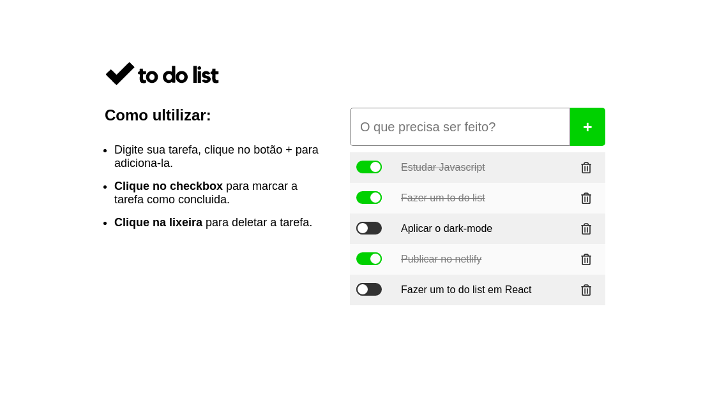

<h1 align='center'>To Do List - Javascript Vanilla</h1>

<h3>🔖 Descrição</h3>

Uma lista simples de tarefas a fazer em um javascript puro vanilla.

<h3>🚀 Tecnologias</h3>
<ul>
    <li>Html</li>
    <li>Css</li>
    <li>Javascript</li>
</ul>

<h3>ℹ️ Como usar</h3>

    # Clone esse repositório
    $ git clone https://github.com/Diegooliveyra/To-Do-List.git
    
    # Executar
    $ index.html

<h3>🖼 Layout</h3>

<h3>📝 Licença</h3>

O projeto se encontra sob licença MIT. Para mais detalhes, acesse <a href='LICENSE'>license<a>.

Criado com 💙 por <a href='https://github.com/Diegooliveyra/' target='blank'>Diego Oliveira</a>
